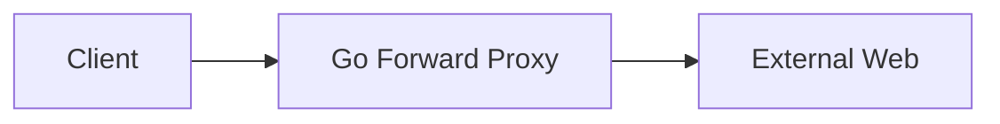
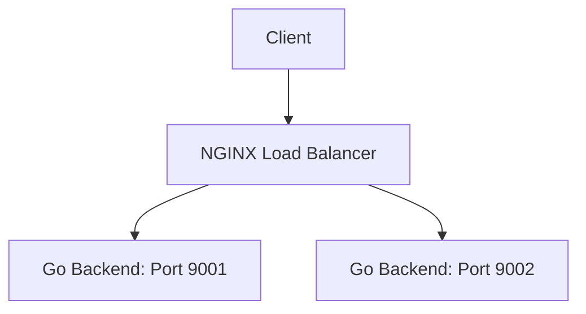

# Proxy Architecture & Load Balancing

A comprehensive exploration of proxy server architectures, featuring custom Forward Proxies, Reverse Proxies, and Load Balancers implemented in Go and NGINX.

---

## Architecture Overview

### 1. Forward Proxy (Client-Side)
Used to protect the client and provide anonymity.


### 2. Reverse Proxy & Load Balancer (Server-Side)
Used to protect the backend and distribute traffic.


---

## Key Features

- **Layered Architecture**: Backend follows a professional Handler/Service separation.
- **Dependency Inversion**: Implemented using Go Interfaces for high flexibility and testability.
- **Round-Robin Load Balancing**: NGINX distributes traffic across multiple dynamic backend instances.
- **Header Injection**: Automated injection of X-Forwarded-For to maintain client identity through the proxy chain.

---

## Tech Stack

- **Language:** Go (Golang)
- **Proxy Engine:** NGINX 1.30.0
- **Testing Tools:** Curl, PowerShell

---

## Execution Guide

### 1. The Load Balancer Demo (NGINX)
Start two backend instances on different ports:
```powershell
# Terminal 1
go run ./reverse_proxy/backend/main.go -port 9001

# Terminal 2
go run ./reverse_proxy/backend/main.go -port 9002
```

Start the NGINX Load Balancer:
```powershell
# Terminal 3
.\nginx-1.30.0\nginx-1.30.0\nginx.exe -p . -c .\nginx\nginx.conf
```

Verify the distribution:
```powershell
curl.exe http://localhost:9005
```

### 2. The Custom Go Proxy
```powershell
go run ./reverse_proxy/proxy/main.go
```

---

## Core Engineering Concepts

### Abstraction via Interfaces
We defined a Greeter interface in the backend. This decouples the HTTP Handler from the actual greeting logic, allowing us to swap implementations without touching the web-server code.

### Dependency Injection
The GreetingService is injected into the AppHandler at startup. This makes the code modular and significantly easier to write Unit Tests for.

### Declarative vs Imperative
- **Nginx (Declarative):** We describe what we want in a config file.
- **Go (Imperative):** We code the logic of how requests are handled.

---

## Project Structure
- `/forward_proxy`: Custom Go implementation of a client-side proxy.
- `/reverse_proxy/backend`: Dynamic, layered Go application.
- `/reverse_proxy/proxy`: Custom Go implementation of a server-side proxy.
- `/nginx`: NGINX configuration for Load Balancing and Header management.
