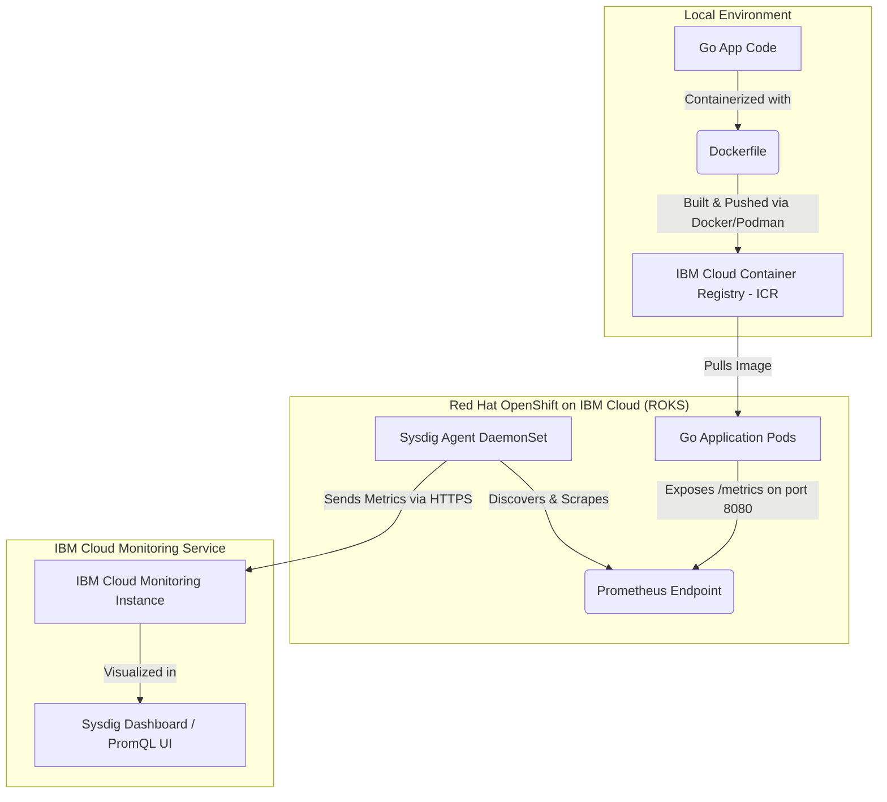

# Learning DevOps Monitoring on IBM Cloud (OpenShift & Sysdig)

Welcome! This guide is designed to take you from **zero knowledge** to successfully deploying a Go application in a Red Hat OpenShift on IBM Cloud (ROKS) cluster, connecting it to IBM Cloud Monitoring (Sysdig), and visualising custom metrics.

---

## 🏗️ Architectural Overview

Before running commands, it's essential to understand how the components interact:



### Key Terms to Know:
1. **Red Hat OpenShift on IBM Cloud (ROKS):** Red Hat's enterprise-grade Kubernetes platform managed by IBM Cloud. It includes built-in security features, routing (ingress), and developer-friendly workflows.
2. **IBM Cloud Monitoring (Sysdig):** A managed monitoring service based on Sysdig. It installs a lightweight agent on your OpenShift nodes that collects system, network, and application-level metrics.
3. **Prometheus Metrics:** A standard format for application metrics. Applications expose metrics in plain text at a `/metrics` URL, which monitoring tools (like Sysdig) regularly "scrape" (pull).

---

## 🛠️ Step 1: Set Up Local Tooling

To interact with IBM Cloud and OpenShift, you need to install a few CLI utilities on your local machine:

1. **IBM Cloud CLI (`ibmcloud`):** The primary CLI tool to manage IBM Cloud resources.
   - [Install IBM Cloud CLI](https://cloud.ibm.com/docs/cli?topic=cli-install-ibmcloud-cli)
2. **Kubernetes (`kubectl`) and OpenShift (`oc`) CLIs:** Used to interact with your OpenShift cluster.
   - The `oc` CLI extends `kubectl` with commands specific to OpenShift features (like projects, routes, and build configs).
   - [Download OpenShift CLI (oc)](https://mirror.openshift.com/pub/openshift-v4/clients/ocp/latest/)
3. **Container Engine (Docker or Podman):** Used to build and package your Go application container.

Once installed, open your shell (PowerShell or Terminal) and run:
```bash
# Verify installation
ibmcloud --version
oc version
```

---

## 🔑 Step 2: Log in and Target Your Sandbox

Because your mentor provided a **Sandbox Child Account**, you likely have access to a specific **Resource Group** where you can create resources.

1. **Log in to IBM Cloud CLI:**
   If your account uses Single Sign-On (SSO) (common for enterprise/child accounts), use the `--sso` flag to retrieve a passcode:
   ```bash
   ibmcloud login --sso
   ```
   *Follow the URL provided in the console, log in, copy the passcode, and paste it into the CLI.*

2. **Target your Region and Resource Group:**
   Replace `us-south` with your assigned region (e.g., `eu-de`, `us-east`), and `your-sandbox-group` with the resource group specified by your mentor:
   ```bash
   ibmcloud target -r us-south -g your-sandbox-group
   ```

3. **Install Required CLI Plugins:**
   ```bash
   # Install container registry and container service plugins
   ibmcloud plugin install container-registry
   ibmcloud plugin install container-service
   ```

---

## ☸️ Step 3: Access or Create your OpenShift Cluster

> [!NOTE]
> Check with your mentor if they have already provisioned an OpenShift cluster for you. If not, follow **Option A** to create one. If yes, proceed directly to **Option B**.

### Option A: Create a New OpenShift Cluster (If needed)
You can create a cluster using the IBM Cloud Console or CLI. Creating a cluster can take **20-45 minutes** to provision fully.
```bash
# Example command to create a small Red Hat OpenShift cluster (Single zone, classic infrastructure)
ibmcloud oc cluster create classic --name devops-learning-cluster --zone dal10 --flavor u3c.2x4 --workers 2 --version 4.13_openshift
```

### Option B: Access an Existing Cluster
1. List your available clusters to find the correct name:
   ```bash
   ibmcloud oc clusters
   ```
2. Retrieve the cluster configuration to connect your local `oc` command line:
   ```bash
   ibmcloud oc cluster config --cluster <your-cluster-name-or-id>
   ```
3. Verify that your CLI can communicate with OpenShift:
   ```bash
   oc get nodes
   ```
   *If successful, you will see a list of worker nodes in your cluster.*

---

## 📊 Step 4: Provision & Connect IBM Cloud Monitoring (Sysdig)

Now we need to create the monitoring service and install the Sysdig Agent in your OpenShift cluster.

### 1. Provision the Monitoring Instance
Go to the **IBM Cloud Catalog**, search for **IBM Cloud Monitoring**, and provision an instance:
- **Location:** Choose the same region as your OpenShift cluster.
- **Resource Group:** Select your sandbox resource group.
- **Plan:** Select the appropriate plan (usually Graduated Tier, or Trial if available).
- **Service Name:** e.g., `devops-monitoring-instance`.

### 2. Connect the Instance to your OpenShift Cluster
IBM Cloud provides a native script command to configure the Sysdig agent in your cluster with one click.
1. In the IBM Cloud Console, go to **Resource List** -> **Services and integration** -> Click your **IBM Cloud Monitoring** instance.
2. Click **Sources** (or **Install Agent**).
3. Select **OpenShift** as your platform.
4. Copy the shell command displayed. It will look similar to this:
   ```bash
   curl -sL https://ibm.biz/install-sysdig-agent | bash -s -- -a <access_key> -c <collector_endpoint> -ac <additional_configurations>
   ```
   *Alternatively, IBM Cloud provides a simple Helm chart deployment or a single button `Connect Cluster` under the IBM Cloud monitoring dashboard.*
5. Run the copied command in your terminal where your `oc` CLI is logged in. It will automatically deploy the **Sysdig Agent** as a `DaemonSet` (running on every node of your cluster).
6. Verify the Sysdig pods are running:
   ```bash
   oc get pods -n ibm-observe
   ```

---

## 🚀 Step 5: Build and Deploy the Go Application

With the cluster and monitoring agent running, let's deploy the Go application.

### 1. Initialize OpenShift Project (Namespace)
In OpenShift, a namespace is referred to as a **Project**:
```bash
oc new-project devops-learning
```

### 2. Build and Push the Go Image to IBM Cloud Container Registry (ICR)
IBM Cloud Container Registry provides secure, private image hosting.

1. Log in to the container registry CLI:
   ```bash
   ibmcloud cr login
   ```
2. Create a namespace in the registry:
   ```bash
   ibmcloud cr namespace-add devops-learning-ns
   ```
3. Check the registry domain (e.g., `us.icr.io` for US, `de.icr.io` for Germany):
   ```bash
   ibmcloud cr region
   ```
4. Build the image locally using the Dockerfile we created (make sure you are inside `go-app/` directory):
   ```bash
   docker build -t us.icr.io/devops-learning-ns/go-metrics-app:latest ./go-app
   ```
5. Push the image to ICR:
   ```bash
   docker push us.icr.io/devops-learning-ns/go-metrics-app:latest
   ```

### 3. Deploy the Manifests
Open [kubernetes/deployment.yaml](file:///c:/Users/User/Desktop/Sandbox-dashboard/kubernetes/deployment.yaml) and ensure the `image` field matches the path of the image you just pushed:
`us.icr.io/devops-learning-ns/go-metrics-app:latest`

Now deploy the manifests to your OpenShift cluster:
```bash
oc apply -f kubernetes/deployment.yaml
```

Check the status of your pods:
```bash
oc get pods -n devops-learning
```
*Wait until you see `STATUS: Running` and `READY: 1/1` for the pods.*

---

## 🔍 Step 6: Trigger Traffic & Verify Metrics

Let's test the Go application and ensure it starts emitting metrics.

1. Find the external route address generated by OpenShift:
   ```bash
   oc get route go-metrics-route -n devops-learning
   ```
   *Look for the `HOST/PORT` column. This is your application's public URL.*

2. Access the application in your browser or run a `curl` script to trigger traffic:
   ```bash
   # Visit the home page
   curl http://<your-route-url>/
   
   # Visit the API endpoint to trigger custom latency and HTTP 200/500 metrics
   curl http://<your-route-url>/api/hello
   ```

3. View raw Prometheus metrics directly from the pod:
   ```bash
   curl http://<your-route-url>/metrics
   ```
   *You should see lines containing `go_app_http_requests_total` and `go_app_active_users_count`.*

---

## 📈 Step 7: View Metrics in IBM Cloud Monitoring (Sysdig)

1. Open the IBM Cloud Console, go to your **Resource List** and find your **IBM Cloud Monitoring** instance.
2. Click **Open Dashboard** to launch the Sysdig web UI.
3. In the left navigation bar, go to **Explore** or **Dashboards**.
4. In the metric search bar, type:
   - `go_app_http_requests_total`
   - `go_app_active_users_count`
5. You can write custom PromQL queries like:
   - **Request rate (Requests per second):**
     ```promql
     sum(rate(go_app_http_requests_total[1m])) by (path, status)
     ```
   - **Average API Latency:**
     ```promql
     sum(rate(go_app_http_request_duration_seconds_sum[5m])) / sum(rate(go_app_http_request_duration_seconds_count[5m]))
     ```

---

## ⚠️ DevOps Troubleshooting Guide

### 1. `ImagePullBackOff` Error
* **Problem:** OpenShift cannot pull your image from IBM Cloud Container Registry (ICR).
* **Fix:** OpenShift requires an image pull secret to read from ICR.
  By default, IBM Cloud automatically provisions a secret called `all-icr-io` in the default namespaces. If you created a new project (`devops-learning`), you may need to link the registry pull secrets to the default service account:
  ```bash
  oc secrets link default all-icr-io --for=pull -n devops-learning
  ```

### 2. Metrics are not showing up in Sysdig
* **Problem:** The Go application runs, but metrics are missing in Sysdig.
* **Fix Checklists:**
  - Verify your pod annotations. Run `oc get pod <pod-name> -o yaml` and check if `prometheus.io/scrape: "true"` is under `spec.template.metadata.annotations`.
  - Ensure the Sysdig agent is running: `oc get pods -n ibm-observe`.
  - Sysdig agent configurations: By default, the Sysdig agent scrapes ports annotated with `prometheus.io/scrape`. If it's disabled in configuration, you might need to enable Prometheus scraping in the Sysdig configmap (`sysdig-agent` configmap inside `ibm-observe` namespace).

### 3. OpenShift Permissions / Security Context Constraint (SCC) issues
* **Problem:** Pod fails to start with permissions issues.
* **Fix:** OpenShift is highly secure by default and restricts container running permissions. Our Dockerfile runs with UID `10001` (non-root), which is the standard practice. OpenShift allows this naturally, but if your pod demands root access, you would need to assign the `anyuid` SCC (not recommended for production):
  ```bash
  oc adm policy add-scc-to-user anyuid -z default -n devops-learning
  ```
